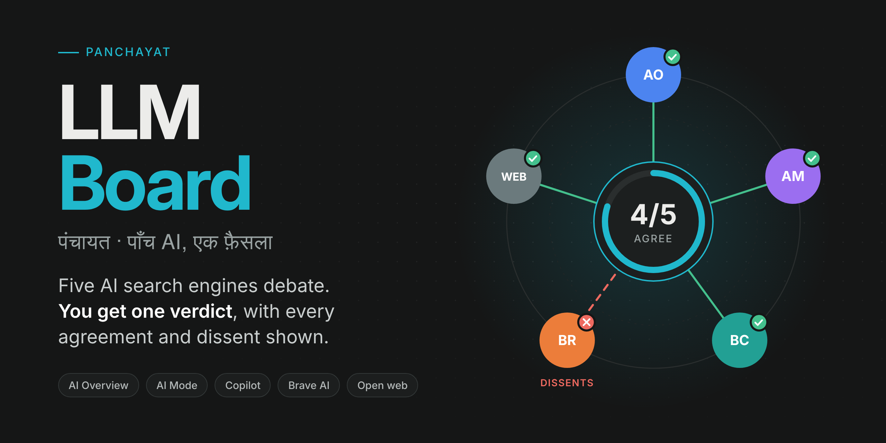
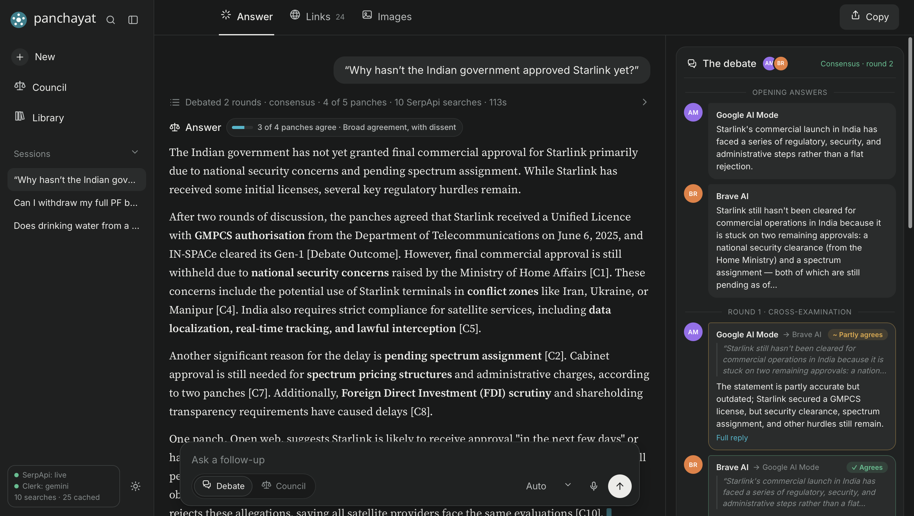
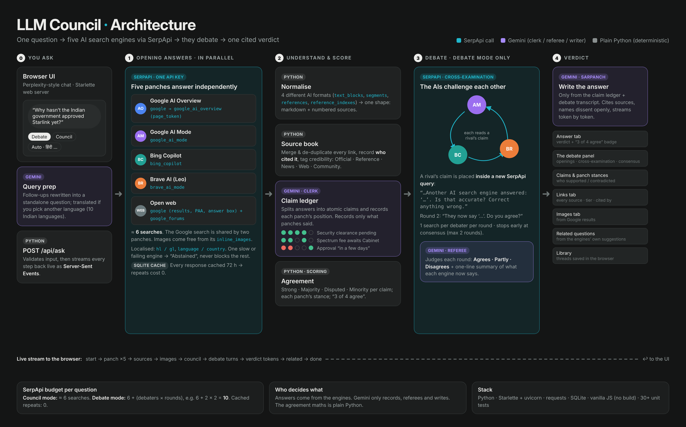
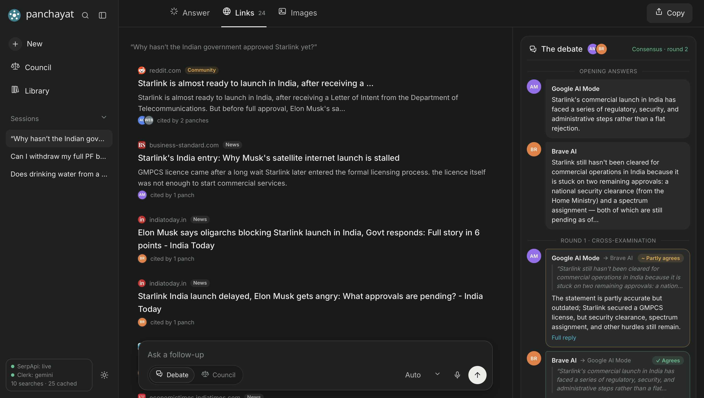

<div align="center">



# LLM Council · पंचायत

**Five AI search engines answer your question, cross-examine each other through SerpApi, and hand you one cited verdict, with every agreement and every dissent shown.**


[The problem](#the-problem) · [How it works](#how-it-works) · [Architecture](#architecture) · [The debate](#the-debate) · [SerpApi usage](#how-serpapi-is-used) · [Quick start](#quick-start)

</div>


<sub>A live run: 4 of 5 panches answered, Google AI Mode and Brave AI debated for 2 rounds and reached consensus, using 10 SerpApi searches.</sub>

---

## The problem

Perplexity for research, Gemini for everyday tasks, Claude for coding: every AI has a reputation. But when a question actually matters (your health, your money, a government decision), **which one do you trust?**

Ask two AI search engines the same question and you often get **two different answers, each sounding completely sure**. Most people ask only one, so they never find out that:

- another AI disagreed,
- the confident answer came from an **outdated** article,
- or it rested on a **single forum post**.

There's been no simple way to see whether AI engines agree, which claims are disputed, and what each claim is based on.

## The idea

An Indian **panchayat** is a council of five that hears every voice before a decision is made. LLM Council does the same for AI answers:

| Role | Who | What it does |
|---|---|---|
| 🧑‍⚖️ **Panches** | Google AI Overview, Google AI Mode, Bing Copilot, Brave AI, Open web | Each answers independently, **live through SerpApi** |
| 🗣️ **Debaters** | Google AI Mode, Bing Copilot, Brave AI | Cross-examine each other's claims, **through SerpApi queries** |
| 📝 **Clerk & referee** | Gemini (or any OpenAI-compatible / Claude model) | Records every claim and who supports or contradicts it; judges each debate round |
| ⚖️ **Sarpanch** | The same model | Writes the verdict **only** from the recorded claims and the debate, with citations |

> **The engines provide the answers. Gemini only records, referees and writes. The agreement score is plain Python.**

---

## How it works

1. **Ask.** Type or speak a question in English or one of 10 Indian languages. Choose **Debate** or **Council** mode.
2. **Five panches answer** in parallel through SerpApi (about 6 searches).
3. **The clerk records the claims.** Every claim is logged with each panch's position: supports, contradicts or silent. Python scores the agreement.
4. **The panches debate** (Debate mode). Each AI engine is shown a rival's claim in a new SerpApi query and asked *"Is that accurate?"* Rounds continue until they agree, up to 2.
5. **The verdict** streams in with citations, the dissent named openly, and every source one click away.

## Architecture



| Stage | What happens | Built with |
|---|---|---|
| **0 · Ask** | Browser sends the question; the server rewrites follow-ups and translates if needed | Starlette, Gemini |
| **① Opening answers** | One question fans out to five AI search engines **in parallel**; responses cached in SQLite | **SerpApi** (6 engines) |
| **② Record & score** | Four answer formats normalised into one; sources merged and credibility-tagged; claim ledger; agreement maths | Python, Gemini (clerk) |
| **③ Debate loop** | Each debater gets a rival's claim **as a new SerpApi query**; Gemini referees; repeat until consensus | **SerpApi**, Gemini (referee) |
| **④ Verdict** | Answer written only from the ledger and debate transcript; streamed live to the browser | Gemini (sarpanch), Server-Sent Events |

Everything streams as Server-Sent Events, so you watch it happen:
`start → query → panch ×5 → sources → media → council → debate_start → debate_turn… → debate_end → token… → answer → related → done`.
Panches run in parallel, and a slow or failing engine shows as *Abstained* without blocking the others.

---

## The debate

The engines only accept search queries, so **the conversation happens inside the queries**:

1. **Round 1 · cross-examination.** In a ring, each engine is shown a rival's opening answer:
   *"… Another AI search engine answered: '<rival's claim>'. Is that accurate? Correct anything that is wrong."*
   Google AI Mode reviews Bing Copilot, Copilot reviews Brave AI, and Brave AI reviews AI Mode.
2. **Round 2 · rebuttal.** Each engine sees what its rival *now* says and is asked whether it agrees.
3. **Refereeing.** After each round, every reply gets a stance (**agrees · partly · disagrees**) and a one-line summary from the Gemini referee. Without an LLM, transparent phrase rules decide (`heuristic_stance()` in [`backend/debate.py`](backend/debate.py)).
4. **Consensus.** When every debater agrees, the debate stops early. Otherwise it ends after `DEBATE_ROUNDS` and names the holdouts.
5. **Verdict.** The sarpanch leads with the position the engines settled on.

In the screenshot above, Google AI Mode told Brave AI its claim was *"partly accurate but outdated"*. That's exactly the kind of correction you never see when you ask a single AI.

**Cost:** one search per debater per round, cached like everything else.

---

## How SerpApi is used

SerpApi is the backbone: every panch and every debate turn is a SerpApi call. **Without SerpApi, this would need five separate scrapers. With SerpApi, it's one API key.**

| Panch | SerpApi engine(s) | What we use |
|---|---|---|
| Google AI Overview | `google` → `google_ai_overview` | `ai_overview.text_blocks`, `references`; follows the short-lived `page_token` and refreshes it automatically if stale |
| Google AI Mode | `google_ai_mode` | `text_blocks` (paragraph, heading, list, table, code), `references`, `reference_indexes`, related questions |
| Bing Copilot | `bing_copilot` | `header`, `text_blocks`, `references` |
| Brave AI | `brave_ai_mode` | `text_blocks` with `segments` and per-segment `citations`, `references`, `related_questions` |
| Open web | `google` + `google_forums` | `answer_box`, `knowledge_graph`, `organic_results`, People-also-ask, forum `answers`, `inline_images` |

All formats are normalised into one shape (markdown + numbered references, [`backend/normalize.py`](backend/normalize.py)) so claims can be compared fairly and traced to their source. Searches are localised with `hl`/`gl` (Google) and `language`/`country` (Brave).

**Searches per question**

| Mode | SerpApi searches |
|---|---|
| Council | ≈ 6 (one Google search is shared by two panches) |
| Debate | 6 + debaters × rounds, e.g. 6 + 2 × 2 = **10** |
| Repeat question | **0** (SQLite cache, 72 h) |

---

## What you see

- **Answer tab:** a Perplexity-style verdict with a ruling badge (*"3 of 4 panches agree · Broad agreement, with dissent"*) and cited claims.
- **The debate panel:** opening answers, each cross-examination (*who reviewed whom* and their stance), and the consensus card.
- **Council view:** an agreement ring, every panch's stance (*Agrees / Partly / Dissents / Abstained*) with its full original answer, and a claim-by-claim vote.
- **Links tab:** every source merged across panches, tagged *Official · Reference · News · Web · Community*, showing which panches cited it.
- **Images tab:** images from the Google results.
- **Debate / Council switch**, **voice input**, **10 Indian languages**, follow-ups with context, related questions, a saved **library** of sessions, and light and dark themes.



### How agreement is measured

For each claim, among the panches that answered:

| Status | Rule |
|---|---|
| **Strong agreement** | ≥ 75% support it and nobody contradicts it |
| **Majority** | More than half support it and supporters outnumber opponents (the dissent count is shown) |
| **Disputed** | There is contradiction and no clear majority |
| **Minority view** | Fewer than half say it, and it's uncontested |

A panch's stance comes from how often it sides with the majority, weighted by importance (*Agrees* ≥ 75%, *Partly* ≥ 40%, otherwise *Dissents*). All of it is deterministic Python in `score_council()` ([`backend/council.py`](backend/council.py)) and covered by tests.

---

## Quick start

**You need:** Python 3.9+ (3.11+ recommended), a free [SerpApi key](https://serpapi.com/users/sign_up) and a free [Gemini key](https://aistudio.google.com/apikey) (optional but recommended).

```bash
git clone https://github.com/mohanarora3/LLM-Board.git && cd LLM-Board
cp .env.example .env        # then add SERPAPI_API_KEY and GEMINI_API_KEY
./run.sh                    # creates .venv, installs, starts the server
```

Open **http://127.0.0.1:8000**. The bottom-left corner should show *SerpApi: live* and *Clerk: gemini*.

Windows (PowerShell): `.\run.ps1` · Manual: `python3 -m venv .venv && source .venv/bin/activate && pip install -r requirements.txt && python -m backend`

| Useful commands | |
|---|---|
| `./run.sh --mock` | Try the UI with bundled sample data, no keys needed (clearly labelled) |
| `python scripts/check_engines.py "is coffee good for you"` | Check your key against every SerpApi engine (about 6 searches) |
| `python scripts/warm_cache.py "your question"` | Pre-run demo questions so they load instantly |


## Project structure

```
backend/
  app.py              HTTP API + static frontend (Starlette)
  pipeline.py         the session: convene → record → score → debate → verdict (async, streaming)
  panches.py          one fetcher per panch (SerpApi engines)
  debate.py           engines cross-examine each other through SerpApi until they agree
  normalize.py        text_blocks / segments / references → markdown + numbered refs
  council.py          sources, claim ledger (LLM + heuristic fallback), agreement scoring
  credibility.py      transparent domain tiers (official, reference, news, web, community)
  llm.py              Gemini / OpenAI-compatible / Anthropic: JSON + streaming, no SDKs
  prompts.py          clerk, referee, sarpanch and query-prep prompts
  serpapi_client.py   SerpApi client with SQLite cache and search counting
  mock.py, fixtures/  offline sample mode in SerpApi's exact response shapes
frontend/             no build step: HTML + CSS + ES modules
scripts/              check_engines.py, warm_cache.py
tests/                unittest suite (no network, no credits)
docs/                 architecture, banner, screenshots, submission notes
```


The suite covers the debate (stance rules, query building, consensus, round limits, the LLM referee), every normaliser against SerpApi-shaped fixtures, source merging and credibility tiers, the scoring rules (including dissent and abstention), the full streaming pipeline with a fake LLM, the fallback when the LLM fails, the stale `page_token` refresh, and the real HTTP API under uvicorn. No network access and no credits needed.


<div align="center">

**Don't trust one AI. Let five debate.**

MIT License

</div>
