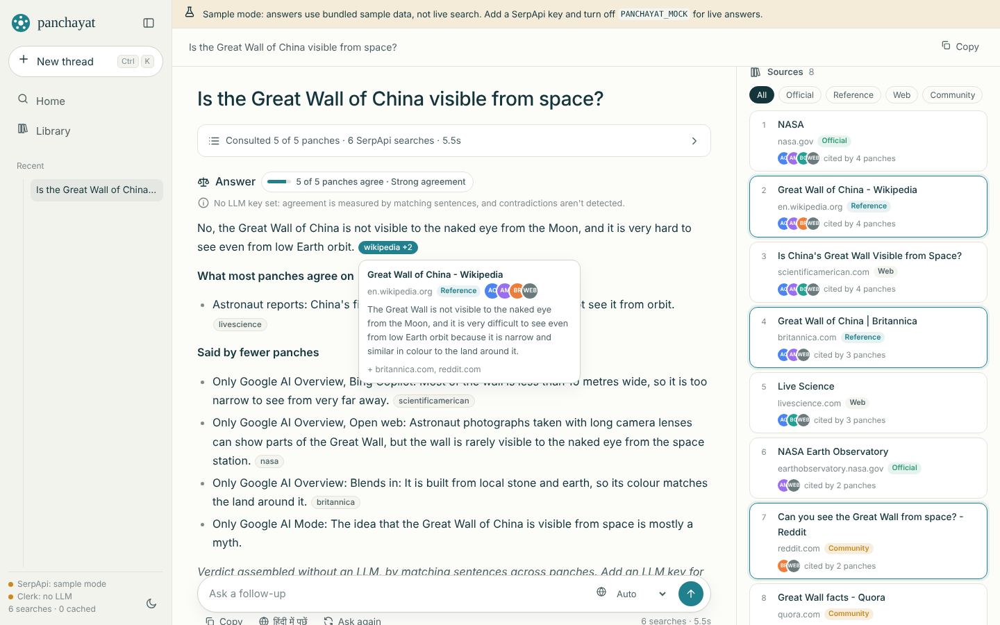
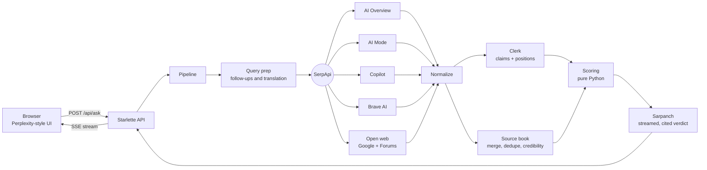

# Panchayat (पंचायत)

**Five AI search engines answer, then debate each other until they agree. You get one verdict.**

Panchayat asks your question to five sources at once (Google AI Overview, Google AI Mode, Bing Copilot, Brave AI and the open web) through [SerpApi](https://serpapi.com). It records what each one claims, measures where they agree and where they disagree, and writes a single cited answer. A side column shows every panch's stance, a claim-by-claim vote, and every source with the panches that cited it.


<sub>Screenshot taken in sample mode (bundled data). Run it with your own keys for live answers.</sub>

---

## The problem

People now ask AI about health, money, government schemes and the news. Different AI search engines often give **different answers to the same question**, each one sounding equally sure. Most people only ask one AI, so they never learn that the others disagree, or that a confident claim rests on a single forum post.

There's been no simple way to see:

- whether the major AI engines agree on an answer,
- which specific claims are disputed, and by whom,
- which sources each AI's claims rest on, and how trustworthy those sources are.

## The idea

An Indian *panchayat* is a council of five that hears every voice before reaching a decision. Panchayat applies the same idea to AI answers:

| Role | Who | What it does |
|---|---|---|
| **Panches** | Google AI Overview, Google AI Mode, Bing Copilot, Brave AI, Open web | Each answers the question independently (live, through SerpApi) |
| **Clerk** | An LLM (Gemini, OpenAI-compatible or Claude), or a no-LLM fallback | Records every claim and each panch's position on it: supports, contradicts or silent |
| **Sarpanch** | The same LLM | Writes the verdict, using only claims from the ledger, with citations, and says openly where panches disagree |

The clerk and sarpanch never add facts of their own. Agreement scores are computed in plain Python from the ledger, not guessed by a model.

## What you see

- **The answer**, Perplexity-style: a direct answer first, then details, with source pills like `wikipedia +2`. Hover a pill to see the source, its credibility tier and which panches cited it.
- **A ruling badge**, for example *"4 of 5 panches agree · Broad agreement, with dissent"*.
- **The council column:**
  - an agreement ring (how strongly the panches back the core answer),
  - every panch with its stance (*Agrees / Partly agrees / Dissents / Abstained*) and its full original answer, plus the claims it disagreed on,
  - **claim by claim**: each claim tagged *Strong agreement / Majority / Disputed / Minority view*, with a vote dot per panch,
  - **sources**, merged across panches, tagged *Official / Reference / News / Web / Community*, each showing who cited it.
- **Follow-ups** that remember context, **related questions** gathered from the engines, and **"हिंदी में पूछें"**, which re-asks the same question in Hindi so you can see whether the verdict changes. Ten Indian languages are supported.
- A **library** of past threads, light and dark themes, and a mobile layout where the council is a slide-over drawer.

## The debate

After the five panches answer, the three that are real AI chat engines (Google AI Mode, Bing Copilot, Brave AI) **argue it out, using nothing but SerpApi searches**. An engine only takes a query, so the conversation lives inside the queries:

1. **Round 1, cross-examination.** In a ring, each engine is shown a rival's opening answer: *"… Another AI search engine answered: "<rival's claim>". Is that accurate? Correct anything that is wrong."* Google AI Mode reviews Bing Copilot, Copilot reviews Brave AI, Brave AI reviews AI Mode.
2. **Round 2+, rebuttal.** Each engine is shown what its rival *now* says and asked whether it agrees.
3. After every round, each reply gets a stance (**agrees / partly / disagrees**) and a one-line summary. The clerk LLM judges this when a key is set; otherwise transparent phrase rules do (`heuristic_stance()` in [`backend/debate.py`](backend/debate.py)).
4. When every engine agrees, the panchayat has **consensus** and the debate stops early. Otherwise it stops after `DEBATE_ROUNDS` and names the holdouts.
5. The sarpanch writes the verdict from the claim ledger **plus the debate transcript**, leading with the position the engines settled on.

The right-hand column shows it live as a group chat: opening answers, each round, who reviewed whom, every stance, the full reply and its sources, and the final *"The panchayat agrees"* card. Turn it off per question with the **Council** mode switch.

**Cost:** one search per debater per round, so at most 6 extra searches with the defaults, cached like everything else.

## How SerpApi is used

SerpApi is the product: every panch is a SerpApi engine. No SerpApi, no council.

| Panch | SerpApi engine(s) | What we take from it |
|---|---|---|
| Google AI Overview | `google` → `google_ai_overview` | `ai_overview.text_blocks` and `references`. When Google loads the overview separately, we follow the short-lived `page_token` (and refresh it automatically if it's stale) |
| Google AI Mode | `google_ai_mode` | `text_blocks` (paragraph, heading, list, table, code), `references`, `reference_indexes`, related questions |
| Bing Copilot | `bing_copilot` | `header`, `text_blocks`, `references` |
| Brave AI | `brave_ai_mode` | `text_blocks` with `segments` and per-segment `citations`, `references`, `related_questions` |
| Open web | `google` + `google_forums` | `answer_box`, `knowledge_graph`, `organic_results`, `related_questions` (People also ask), and forum `answers` (what real people say) |

All five formats are normalized into one shape (markdown plus numbered references, see [`backend/normalize.py`](backend/normalize.py)), so the clerk can compare them fairly and every claim can be traced back to its source.

**Cost:** about **6 SerpApi searches per new question**. One Google search is shared by two panches. Results are cached in SQLite (72 h by default), so repeat questions are free and instant. The free plan's 250 searches/month cover about 40 fresh questions.

Localization: `hl`/`gl` for Google engines and `language`/`country` for Brave, so a question asked in Hindi is searched in Hindi, in India.

## Architecture



The answer streams as Server-Sent Events: `start → query → panch ×5 (as each arrives) → sources → media → council → debate_start → debate_round / debate_turn… → debate_end → token… → answer → related → done`. Panches run in parallel, and one failing or slow engine never blocks the others (it shows as *Abstained*).

```
backend/
  app.py              HTTP API + static frontend (Starlette)
  pipeline.py         the session: convene → record → score → verdict (async, streaming)
  panches.py          one fetcher per panch (SerpApi engines)
  normalize.py        text_blocks / segments / references → markdown + numbered refs
  council.py          sources, claim extraction (LLM + heuristic), agreement scoring
  debate.py           the engines cross-examine each other through SerpApi until they agree
  credibility.py      transparent domain tiers (official, reference, news, web, community)
  llm.py              Gemini / OpenAI-compatible / Anthropic, JSON + streaming, no SDKs
  prompts.py          clerk, sarpanch and query-prep prompts
  serpapi_client.py   SerpApi client with SQLite cache and search counting
  mock.py, fixtures/  offline sample mode in SerpApi's exact response shapes
frontend/             no build step: HTML + CSS + ES modules
scripts/              check_engines.py, warm_cache.py
tests/                30 unittest tests (normalizers, scoring, pipeline, live HTTP API)
```

### How agreement is measured

For each claim, among the panches that answered:

- **Strong agreement**: at least 75% support it and no one contradicts it.
- **Majority**: more than half support it, and supporters outnumber opponents (a dissent count is shown).
- **Disputed**: there is contradiction and no clear majority.
- **Minority view**: said by fewer than half, uncontested (often just an extra detail).

Each panch's **stance** comes from how often it sides with the majority on claims it took a position on, weighted by importance (*Agrees* ≥ 75%, *Partly* ≥ 40%, otherwise *Dissents*). The **agreement ring** is the importance-weighted share of panches backing the core claims, net of contradictions. All of this lives in `score_council()` in [`backend/council.py`](backend/council.py) and is covered by tests.

Without an LLM key, the clerk falls back to clustering similar sentences across panches. It still measures agreement, but it can't detect contradictions, and the UI says so.

## Quick start

**Requirements:** Python 3.9+ (3.11+ recommended), a [SerpApi key](https://serpapi.com/users/sign_up) (free), and optionally a free [Gemini key](https://aistudio.google.com/apikey) for the clerk.

```bash
git clone <your-repo-url> panchayat && cd panchayat
cp .env.example .env          # add SERPAPI_API_KEY and GEMINI_API_KEY
./run.sh                      # creates .venv, installs, starts the server
# open http://127.0.0.1:8000
```

Windows (PowerShell): `.\run.ps1`

Manual setup:

```bash
python3 -m venv .venv && source .venv/bin/activate
pip install -r requirements.txt
python -m backend
```

**Try the interface without any keys:** `./run.sh --mock` (or `PANCHAYAT_MOCK=1 python -m backend`). This replays bundled sample data shaped exactly like SerpApi responses, and a banner makes clear it isn't live.

**Check your key against every engine** (about 6 searches):

```bash
python scripts/check_engines.py "is coffee good for you"
```

**Before a demo**, pre-run your questions so they're cached and instant:

```bash
python scripts/warm_cache.py "Is it safe to give paracetamol and ibuprofen together to a child?"
```

## Configuration

| Variable | Default | Meaning |
|---|---|---|
| `SERPAPI_API_KEY` | (required) | Your SerpApi key |
| `LLM_PROVIDER` | `auto` | `gemini`, `openai`, `anthropic` or `none`. `auto` uses the first key it finds |
| `GEMINI_API_KEY` / `OPENAI_API_KEY` / `ANTHROPIC_API_KEY` | (empty) | Key for the clerk |
| `OPENAI_BASE_URL` | OpenAI | Any OpenAI-compatible server: Groq, OpenRouter, Ollama, LM Studio |
| `LLM_MODEL` | per provider | e.g. `gemini-2.5-flash`, `gpt-4o-mini`, `llama-3.3-70b-versatile` |
| `COUNTRY` / `DEFAULT_LANG` | `in` / `en` | Search country and default language |
| `PANCHES` | all five | Which panches sit on the council |
| `CACHE_TTL_HOURS` | `72` | How long SerpApi results are reused |
| `PANCHAYAT_MOCK` | `0` | `1` = sample data, no SerpApi calls |
| `DEBATE_ROUNDS` | `2` | Maximum debate rounds (0 turns the debate off, max 4) |

## Tests

```bash
python -m unittest discover -s tests -t .
```

Forty tests cover the debate (stance rules, query building, consensus, round limits, the LLM referee), every normalizer against SerpApi-shaped fixtures, source merging and credibility tiers, the scoring rules (including dissent and abstention), the full streaming pipeline with a fake LLM, the fallback when the LLM fails, the stale `page_token` refresh, and the real HTTP API under uvicorn. They need no network access and spend no credits.

## Honest limitations

- The clerk is an LLM. It's constrained to record only what the panches said, and all scoring is deterministic code, but extraction can still be imperfect. The full original answer of every panch is one click away so anyone can check.
- Agreement is not truth. Five engines can repeat the same mistake. That's why sources are shown with credibility tiers and *who cited what*: agreement that rests on one weak blog is visible as such.
- Credibility tiers are a simple, transparent domain list ([`backend/credibility.py`](backend/credibility.py)). They're shown as hints and never used to hide a source.
- Availability of AI answers varies by query and region. When an engine has nothing to say, it's shown as *Abstained*, not counted as disagreement.

## Roadmap

- Side-by-side **language gap** view (same question in English and Hindi, claim by claim).
- Add DuckDuckGo Search Assist and Naver AI Briefing as optional panches.
- Shareable verdict links and a browser extension for fact-checking a highlighted claim.

## Built for

The **SerpApi India Hackathon 2026**, *Knowledge & Public Interest* track. AI-assisted development disclosure: see [`docs/SUBMISSION.md`](docs/SUBMISSION.md).

## License

MIT
